# Education ERP (Version 1.0, Foundation Release)

Multi-institute Education ERP foundation: authentication, institute management,
user hierarchy, teacher accounts, dynamic role-based permissions and separate dashboards.

Out of scope for V1: student admissions, classes, subjects, attendance, examinations,
fees, academic reporting and payment gateways.

## Tech stack

| Layer         | Choice                                                                 |
| ------------- | ---------------------------------------------------------------------- |
| Backend       | Laravel 12, PHP 8.3                                                    |
| Database      | MySQL 8                                                                |
| Views         | Blade, Materialize (Bootstrap 5)                                       |
| Build         | Vite, npm                                                              |
| RBAC          | spatie/laravel-permission 8.x (Teams mode, `institute_id` as team key) |
| Authorization | Policies, Gates, permission middleware, institute global scope         |
| Validation    | Form Requests                                                          |
| Tests         | PHPUnit feature tests (separate `education_erp_test` database)         |

## Requirements

- PHP 8.3 or higher
- Composer
- Node 18 or higher
- MySQL 8

## Setup

```bash
git clone <repo-url> education-erp
cd education-erp
composer install
npm install --legacy-peer-deps
cp .env.example .env
php artisan key:generate
```

Create two empty MySQL databases: `education_erp` and `education_erp_test`.
Set `DB_USERNAME` and `DB_PASSWORD` in `.env`, then run:

```bash
php artisan migrate:fresh --seed
php artisan storage:link
npm run build
php artisan serve
```

Open http://localhost:8000.

## Demo credentials (development only)

See `DEV_CREDENTIALS.md`. All demo users share the password in `SEED_PASSWORD`
(default `password`).

| Role            | Email                           | Institute                                  |
| --------------- | ------------------------------- | ------------------------------------------ |
| Super Admin     | superadmin@example.com          | none                                       |
| Institute Admin | admin.a@example.com             | DEMO-A (active)                            |
| Institute Admin | admin.b@example.com             | DEMO-B (active)                            |
| Institute Admin | admin.c@example.com             | DEMO-C (inactive, login blocked by design) |
| Teacher         | teacher1.a@example.com (1 to 3) | DEMO-A                                     |
| Teacher         | teacher1.b@example.com (1 to 3) | DEMO-B                                     |

## Features

- Email and password login, logout, session regeneration, CSRF protection, login rate limiting
- Inactive user and inactive institute handling (login blocked, active sessions ended)
- Institute management: create, edit, view, activate and deactivate, logo upload,
  search, status filter and pagination
- Institute Admin management (Super Admin)
- Teacher accounts: create, edit, activate and deactivate, delete, search and filter
- Custom roles with delegable permissions, and user role assignment
- Role-aware sidebar menu
- Dashboards for Super Admin, Institute Admin and Teacher
- Profile and password update
- Activity log (shown on the Institute Admin dashboard)
- 403 access denied page

## Roles and permissions

- **Super Admin** manages institutes and Institute Admins, views all users and sees global metrics.
- **Institute Admin** manages teachers and custom roles for their own institute only.
- **Teacher** logs in, edits their own profile and uses only the permissions granted by their role.
- Hierarchy defines scope, not inheritance. Every request checks permission and institute ownership.
- Institute Admins can grant only permissions flagged `is_delegable`.
- The `Super Admin` and `Institute Admin` roles are protected and cannot be edited or deleted.
- Nobody except a Super Admin can assign the Super Admin role.
- Records of another institute return 404, enforced by a global scope plus policies.
- The Super Admin uses Spatie team id `0`, because pivot primary keys cannot be NULL.

## Database

Main tables: `institutes`, `users`, `teachers`, `activity_logs`, plus the Spatie tables
(`roles`, `permissions`, `model_has_roles`, `model_has_permissions`, `role_has_permissions`).
The ER diagram is in `docs/ER_DIAGRAM.md`.

Additions beyond the base spec, required to implement the rules:

- `permissions.is_delegable`: marks permissions an Institute Admin may delegate
- `roles.is_protected`: protects Super Admin and Institute Admin roles
- `roles.institute_id`: institute scope for custom roles (NULL means global role)

## Tests

```bash
php artisan test
```

98 tests cover authentication, RBAC, cross-institute isolation, institutes, institute admins,
teachers, roles, profile, dashboards, menu visibility and seeders.

Tests run against the `education_erp_test` database, so development data is never touched.

## Production checklist

- Set `APP_ENV=production` and `APP_DEBUG=false`
- Generate a new `APP_KEY`, and never commit `.env`
- Set a strong `SEED_PASSWORD`, or do not run the demo seeders. Run only `PermissionSeeder`
  and `RoleSeeder`, then create the real Super Admin manually.
  The seeder refuses to run in production without `SEED_PASSWORD`.
- Remove all `example.com` demo users
- Use HTTPS and set `SESSION_SECURE_COOKIE=true`
- Use a strong database password (not an empty root password)
- Run `php artisan config:cache`, `route:cache` and `view:cache`

## Project structure

```
app/Http/Controllers   Controllers (Auth, Institute, InstituteAdmin, Teacher, Role, UserRole, Dashboard, Profile)
app/Http/Middleware    EnsureUserIsActive, SetPermissionsTeam, NoCacheHeaders
app/Http/Requests      Form Requests grouped by feature
app/Models             Institute, User, Teacher, ActivityLog, Concerns/BelongsToInstitute
app/Policies           InstitutePolicy, TeacherPolicy, RolePolicy
app/Services           ActivityLogger, PrivilegeGuard
database/seeders       Permission, Role, SuperAdmin, Institute, InstituteAdmin, Teacher seeders
tests/Feature          Feature tests
```

## Screenshots

### Login

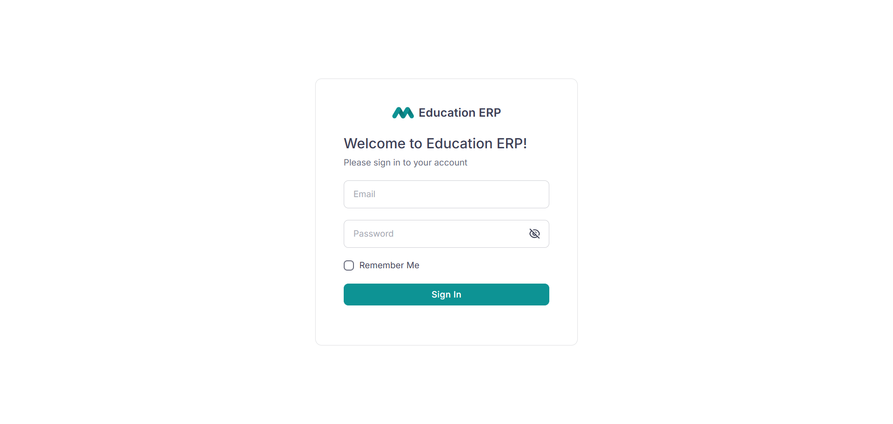

### Super Admin dashboard

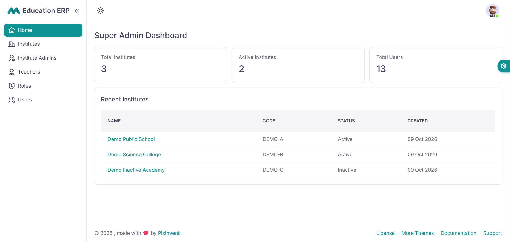

### Institutes list (search and filter)

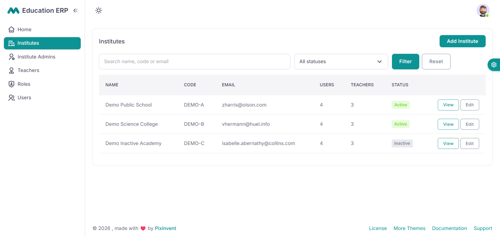

### Institute Admin dashboard

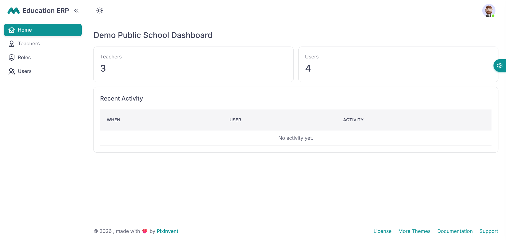

### Teachers list

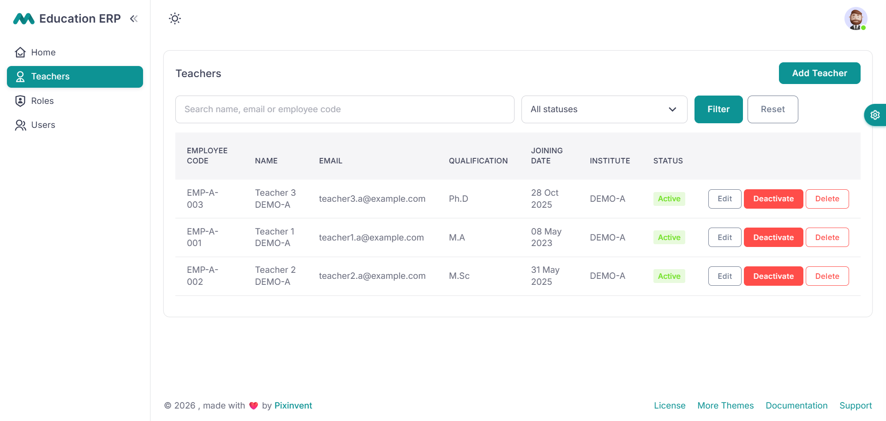

### Add role (delegable permissions only)

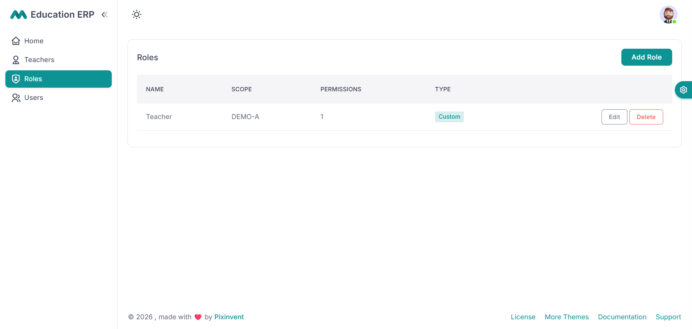

### Teacher dashboard

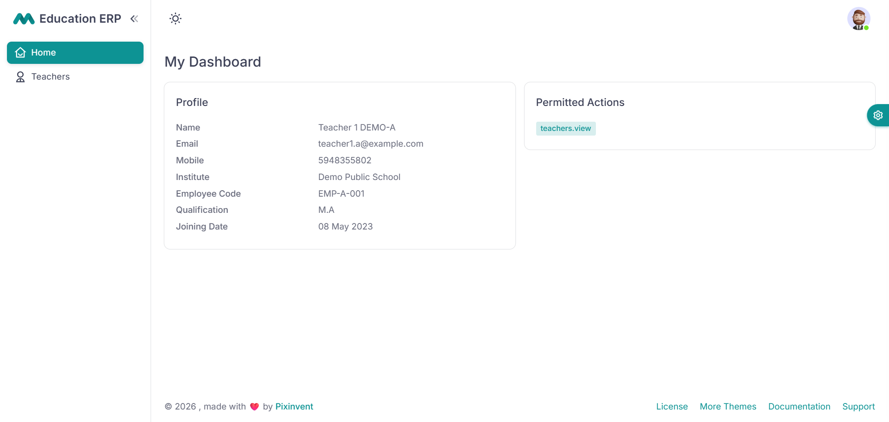

### Access denied (403)

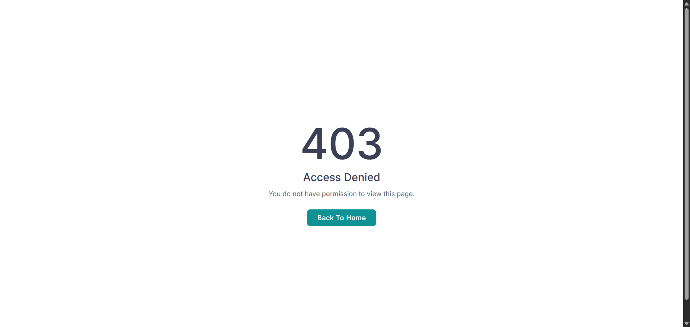

### Institute Admins (Super Admin)

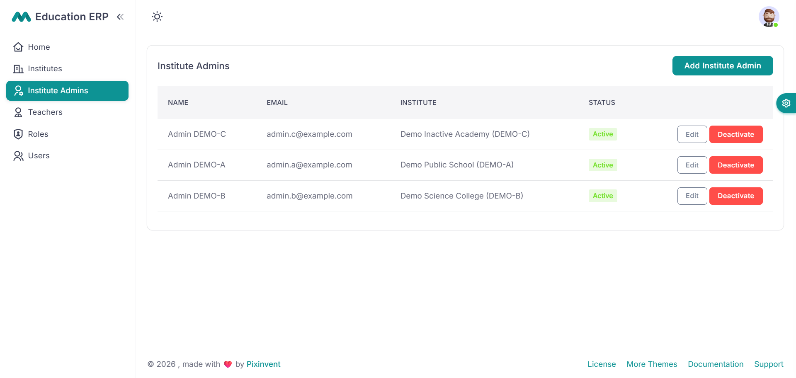

### Assign roles to a user

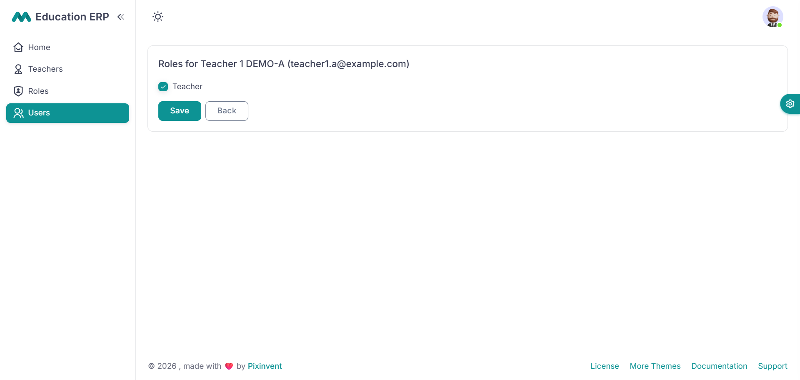

### Profile and password update

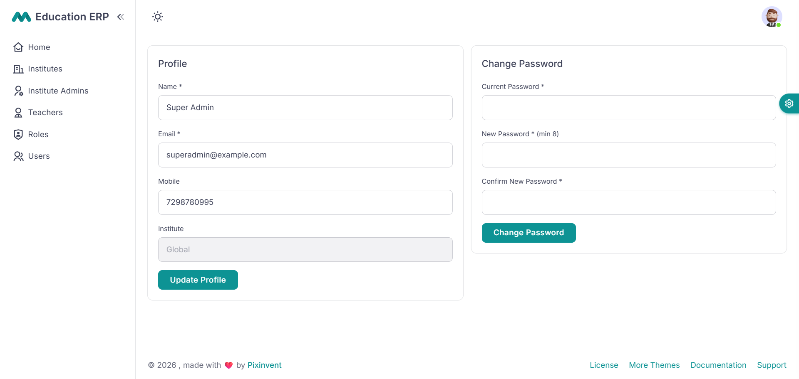
