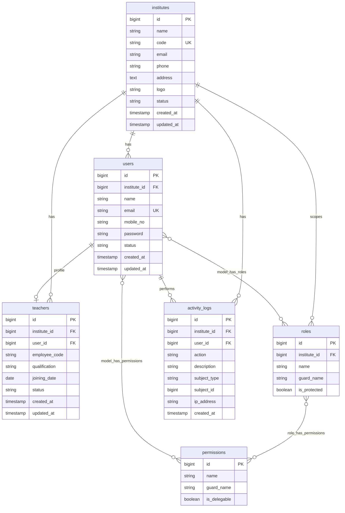

# ER Diagram

## Constraints

- `teachers`: unique (`institute_id`, `employee_code`), unique `user_id`
- `roles`: unique (`institute_id`, `name`, `guard_name`); `institute_id` NULL means a global role
- `model_has_roles` and `model_has_permissions` carry `institute_id` as the Spatie team key (Super Admin uses 0)
- `users.institute_id` and `teachers.institute_id`: restrict on delete
